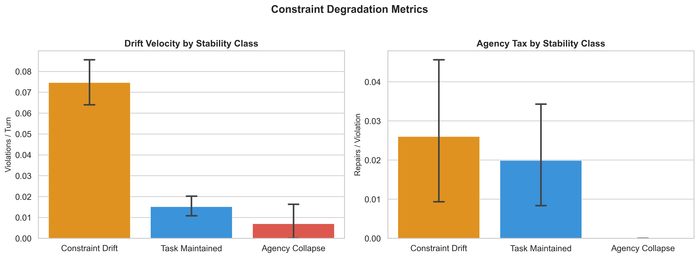
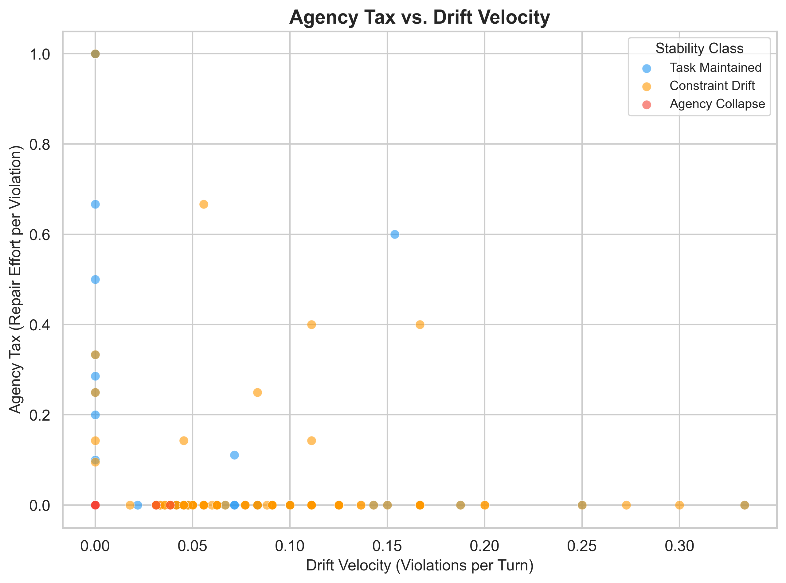
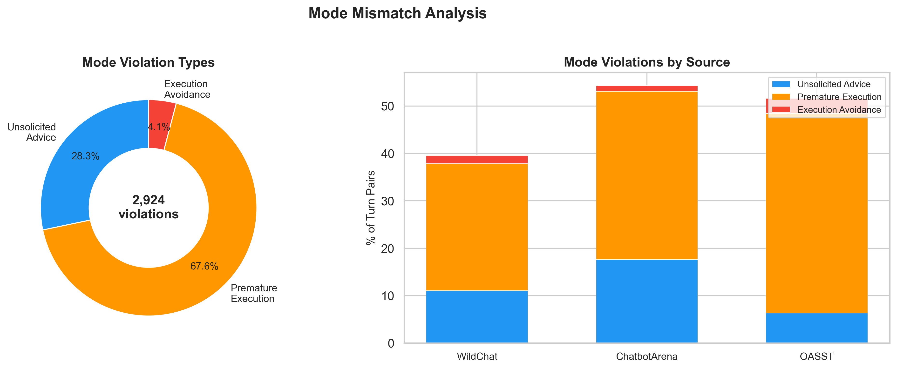

# Atlas Pipeline: Comprehensive Findings Report

**Date:** February 5, 2026
**Status:** Complete — Canonical Run (Post-Fix)
**Subject:** Empirical Analysis of Constraint Survival, Mode Violations, and Repair Behaviour in LLM Interactions

**Data Source:** `data/atlas_canonical/metrics/aggregate.json`
**Pipeline Run:** February 5, 2026, `--force` flag, gpt-4o-mini
**Visualization Source:** `scripts/atlas/generate_visualizations.py`

---

## 1. What We Found

We processed **744 multi-turn conversations** (535 WildChat, 180 Chatbot Arena, 29 OASST) through the Atlas Graph Pipeline. The pipeline extracts communicative moves from every turn, tracks user constraints through a lifecycle state machine, detects mode mismatches between user intent and AI behaviour, and computes per-conversation degradation metrics.

The central finding: **conversational AI systems silently fail to maintain user constraints. Users repair roughly 1 in 5 constraint violations — meaningful but insufficient.**

### The Four Key Numbers

| Finding | Metric | Value |
|---------|--------|-------|
| **Constraints usually die** | Constraint survival rate | **28.5%** (107 of 376 survived) |
| **They die fast** | Constraint half-life | **2.49 turns** |
| **Users fight back sometimes** | Repair attempt rate | **19.9%** (54 repairs / 271 constraint violations) |
| **The AI also oversteps** | Mode violation rate | **42.0%** of turn pairs (led by UNSOLICITED_ADVICE at 11.7%) |

Nearly three out of four verified, specific constraints end in unrepaired violation. The typical constraint is first violated within 2-3 turns of being stated. When users do attempt repair, the data shows a 19.9% repair-to-violation ratio — users are not passive, but their repair efforts are insufficient to overcome the rate of violation.

**Two distinct failure types.** This report separates *constraint violations* (the AI fails to satisfy a stated requirement; 271 events) from *mode violations* (the AI responds in the wrong interaction mode; 2,924 events). These have different causes, different rates, and different implications. Previous versions of this report conflated them, reporting a misleading 1.7% repair rate against the combined total of 3,195.

### What Changed in This Run

This canonical run differs from earlier pipeline versions in four ways:

1. **Constraint Quality Filter.** The upstream classifier now rejects aspirational constraints ("provide accurate information", "be helpful") and meta-goals. This reduced the constraint count from ~2,160 to **376**, but these 376 are verifiable, specific, and concrete. The 71.5% violation rate on *verified* constraints is a stronger finding than the previous ~47.5% on a noisier set.

2. **Unmatched Violation Fix.** The constraint tracker previously assigned unmatched violations (those the LLM flagged but couldn't match to a specific constraint) to the first active constraint. This inflated violation counts for early constraints. Unmatched violations are now logged separately.

3. **Negative Lifespan Fix.** The constraint state machine previously allowed violations at turns before a constraint's introduction, producing negative lifespans (132 of 375 constraints). A guard now ensures `effective_turn = max(turn_index, introduced_at)` and only matches violations to constraints that have been introduced by the current turn. Mean constraint lifespan increased from 0.60 to **5.80 turns**.

4. **Canonical Data Source.** All numbers sourced from a single pipeline run with `--force`, eliminating discrepancies from cached partial results.

---

## 2. How We Measured It

### 2.1 Dataset

| Source | N | % | Description |
|--------|---|---|-------------|
| **WildChat** | 535 | 71.9% | Real-world, in-the-wild user queries (coding, creative writing, advice) |
| **Chatbot Arena** | 180 | 24.2% | Adversarial and comparative testing |
| **OASST** | 29 | 3.9% | Instructional and goal-oriented dialogues |
| **Total** | **744** | | |

The original corpus comprised 983 classified conversations. 239 failed during atlas graph construction (primarily LLM move-classification errors on non-English or code-heavy conversations), yielding 744 successfully processed conversations. This 24.3% attrition rate is a limitation — if failures correlate with conversation difficulty, the surviving sample may underrepresent edge cases.

Of the 744 conversations, **184 contain at least one verified constraint** (24.7%) and **560 have no constraints** (75.3%). The high proportion without constraints reflects the tightened quality filter: many conversations contain only aspirational or vague preferences that do not meet the verifiability threshold.

### 2.2 The Atlas Pipeline

Three components process each conversation:

**Move Classifier (Hybrid).** Decomposes every turn into communicative moves using regex for structural signals (constraint proposals, repair markers, passive acceptance) and GPT-4o-mini for semantic comparison (detecting whether an assistant output violates an active constraint). Mean move coverage: 55.5% of turns receive at least one classified move.

**Mode Detector.** Classifies user-requested mode (Listener/Advisor/Executor) and AI-enacted mode independently per turn pair. Identifies mode violations when these diverge: `PREMATURE_EXECUTION`, `UNSOLICITED_ADVICE`, `EXECUTION_AVOIDANCE`. Known limitation: any assistant output >300 chars is classified as EXECUTOR, inflating `PREMATURE_EXECUTION`.

**Constraint Tracker.** A state machine tracking each constraint: `STATED` → `ACTIVE` → `VIOLATED` → `REPAIRED` | `ABANDONED` | `SURVIVED`. Violations are matched to specific constraints using token similarity. Unmatched violations (those the system can't attribute to a specific constraint) are logged separately rather than misattributed. A guard ensures constraints cannot be violated at turns before their introduction.

### 2.3 Constraint Quality Filter

The upstream task classifier applies a quality filter requiring all emitted constraints to be:
- **Verifiable:** A third party could check pass/fail against the AI response
- **Specific:** Names a concrete behaviour, format, boundary, or exclusion
- **Not aspirational:** Rejects quality standards ("provide accurate information", "be helpful")
- **Not meta-goals:** Rejects general competence descriptions

This reduced the constraint count from ~2,160 to **376**. The remaining constraints are things like "use Python 3", "keep it under 500 words", "don't include any code", "format as a numbered list" — concrete requirements where violation is unambiguous.

### 2.4 Distinguishing Violation Types

The pipeline tracks two fundamentally different types of violation:

| Type | Count | What It Measures | Repair Denominator |
|------|-------|------------------|--------------------|
| **Constraint violations** | 271 | AI fails to satisfy a stated, verifiable user requirement | 54 repairs / 271 = **19.9%** |
| **Mode violations** | 2,924 | AI responds in the wrong interaction mode (e.g., advises when user is sharing information) | Not applicable (mode violations are per-turn-pair, not repairable in the same sense) |

These must not be combined. Earlier versions of this report reported a repair rate of 1.7% (54/3,195), which conflated two unrelated phenomena. The correct constraint repair rate is **19.9%** — users do push back on about 1 in 5 constraint violations.

### 2.5 Accuracy Estimates

| Component | Estimated Accuracy | Notes |
|-----------|-------------------|-------|
| Move detection | ~85% | False-positive constraint proposals from deontic expressions |
| Constraint lifecycle | ~95% | Robust due to seeding from upstream classifier |
| Mode detection | ~80% | Length bias inflates PREMATURE_EXECUTION |

Based on manual inspection of 20 randomly sampled conversations (2.7% of corpus). A formal inter-rater reliability study is planned (see `paper/IRR_STUDY_PLAN.md`).

---

## 3. What the Data Shows

### 3.1 The Context Cliff: Constraints Die Fast

Constraints do not slowly degrade over long conversations. They break early and on assistant turns.

*Figure 1: Distribution of constraint survival rates across conversations with at least one constraint (N=184). The left skew shows most constrained conversations fail to preserve their constraints.*

*Figure 2: Constraint violations by turn index with cumulative overlay. Violations concentrate on odd turns (assistant responses): turn 1 (68), turn 3 (50), turn 5 (32), turn 7 (30). 50% of all constraint violations occur within the first few turns.*

**Constraint Final States (N=376):**

| Final State | Count | % | What This Means |
|-------------|-------|---|-----------------|
| SURVIVED | 107 | 28.5% | Constraint was intact when the conversation ended |
| VIOLATED | 269 | 71.5% | Violated and never successfully repaired — silent failure |

*Figure 3: Constraint final state distribution. No constraints ended in the ABANDONED state — users never explicitly gave up on a constraint.*

The mean constraint half-life is **2.49 turns**. The violation timing pattern — concentrated on odd turns (1, 3, 5, 7) — confirms these are assistant-response failures, not user-side issues. Turn 1 alone accounts for 25% of all constraint violations, meaning the first response after a constraint is stated is the most dangerous.

The complete absence of ABANDONED constraints is significant: users do not make a conscious decision to drop constraints. They state a requirement, the AI violates it, and the user either attempts repair (19.9% of the time) or silently accepts the result (80.1%).

**Mean constraint lifespan: 5.80 turns.** After fixing the negative-lifespan bug, this reflects the actual distance between constraint introduction and final state change.

### 3.2 The Repair Gap: Users Push Back — But Not Enough

We defined **Agency Tax** as the ratio of repair moves to violation events — the effort users spend trying to correct the AI. The data reveals a more nuanced picture than previously reported.

**Constraint Violations vs Repairs:**

| Metric | Value | Context |
|--------|-------|---------|
| Constraint violations | 271 | Across 184 constrained conversations, 376 constraints |
| Repair attempts | 54 | **19.9%** of constraint violations receive a repair attempt |
| Per-conversation repair success | 0.1% | Mean per-conversation success rate |

Users attempt repair for roughly **1 in 5 constraint violations** — a meaningful rate of engagement. This contradicts a narrative of complete user passivity. However, the low per-conversation repair success rate (0.1%) means that even when users push back, the conversational structure makes sustained repair difficult. The AI may acknowledge the correction but reintroduce the violation in subsequent turns.

The gap between repair attempt rate (19.9%) and successful repair is the core finding: **users are not passive, but the repair mechanism is broken.** This reframes the design implication from "users need to be prompted to repair" to "repair attempts need to be more effective."

*Figure 4: Drift velocity and agency tax by stability class. Constraint Drift conversations show the highest drift rate.*

**By Stability Class:**

| Stability Class | N | Drift Velocity | Agency Tax | Survival | Notes |
|----------------|---|---------------|-----------|----------|-------|
| Constraint Drift | 147 | 0.075 | 0.026 | 21.3% | Highest drift — constraints actively degraded |
| Task Maintained | 304 | 0.015 | 0.020 | 4.4% | Low drift, low survival — constraints may never activate |
| Agency Collapse | 10 | 0.007 | 0.000 | 5.0% | **N=10, interpret with caution** |
| Task Shift | 7 | 0.007 | 0.143 | 9.5% | Highest agency tax — users actively redirecting |
| No Constraints | 276 | 0.000 | 0.015 | 0.0% | No constraints to track; mode violations only |

**Agency Collapse (N=10) caveat.** This stability class contains only 10 conversations — too few for reliable statistical inference. The zero agency tax and 5.0% survival rate are directionally interesting but should not be used for claims about agency collapse patterns without additional data.

Constraint Drift conversations have the highest drift velocity (0.075 violations/turn) — these are the cases where the AI actively degrades constraints. Task Maintained conversations are the largest class (N=304) with low but non-zero drift (0.015), suggesting even "successful" conversations contain some violations.

The No Constraints class (N=276, 37.1%) is large because the tightened quality filter correctly identifies many conversations as having no verifiable constraints. These still show mode violations, confirming that mode mismatch is independent of constraint presence.

*Figure 5: Agency Tax vs. Drift Velocity scatter. Constraint Drift conversations cluster in the high-drift region, while Task Maintained conversations cluster near the origin.*

### 3.3 Mode Violations: The AI Answers Questions Nobody Asked

42.0% of user-assistant turn pairs (2,924 of ~7,000) contain a mode violation — the AI responds in a different interaction mode than the user requested. But not all mode violations are equally reliable signals.

**These are distinct from constraint violations.** Mode violations measure a mismatch between user intent and AI response *type* (advising vs executing vs listening). Constraint violations measure failure to satisfy a *specific requirement*. A conversation can have mode violations without any constraints, and vice versa.

*Figure 6: Mode violation type breakdown (left) and mode violation rates by source (right). UNSOLICITED_ADVICE is the most reliable signal.*

| Violation Type | Count | % of Mode Violations | % of All Pairs | Reliability | Description |
|---------------|-------|---------------------|----------------|-------------|-------------|
| **UNSOLICITED_ADVICE** | **822** | **28.1%** | **11.7%** | **High** | AI gives recommendations when user was sharing information |
| PREMATURE_EXECUTION | 1,965 | 67.2% | 28.0% | Upper bound | AI generates output when user asked for advice or was providing context |
| EXECUTION_AVOIDANCE | 123 | 4.2% | 1.8% | Moderate | AI asks clarifying questions when user requested output |

**Why UNSOLICITED_ADVICE matters most.** This violation type is detected via semantic mismatch between user intent and AI response type, and is not inflated by the length-based heuristic that affects PREMATURE_EXECUTION detection. When the AI gives advice to a user who was simply sharing information, it reveals a genuine failure to read the interaction's purpose. 11.7% of all turn pairs exhibit this behaviour — roughly 1 in 9 exchanges.

**PREMATURE_EXECUTION should be treated as an upper bound.** The mode detector classifies any long assistant output (>300 chars) as EXECUTOR mode. Many information-seeking responses are long but appropriate. The true rate is likely lower than 28.0%, though the signal still indicates a real default-to-output tendency.

**By Source:**

| Source | N | Drift Vel. | Agency Tax | Survival | Mode Viol. |
|--------|---|-----------|-----------|----------|-----------|
| WildChat | 535 | 0.028 | 0.025 | 6.1% | 37.1% |
| Chatbot Arena | 180 | 0.007 | 0.006 | 2.6% | 54.3% |
| OASST | 29 | 0.023 | 0.017 | 1.7% | 54.0% |

Chatbot Arena and OASST show higher mode violation rates (~54%) than WildChat (37%). This likely reflects their shorter, more instruction-oriented format where the AI defaults to EXECUTOR mode. WildChat shows the highest Agency Tax (0.025) — real-world users are more likely to attempt repair than users in benchmark settings.

### 3.4 Where Constraints Fail: Architecture and Hardness

Not all tasks are equal. Planning tasks drift fastest, while Transformation tasks survive longest.

**By Task Architecture:**

| Architecture | N | Drift Vel. | Agency Tax | Survival | Mode Viol. |
|-------------|---|-----------|-----------|----------|-----------|
| **Planning** | 27 | **0.053** | 0.004 | 2.5% | 39.8% |
| **Generation** | 255 | 0.032 | 0.028 | 9.5% | 32.3% |
| Transformation | 67 | 0.022 | 0.032 | **14.3%** | **19.5%** |
| Analysis | 185 | 0.016 | 0.020 | 3.7% | 48.2% |
| Information Seeking | 200 | 0.009 | 0.008 | 2.3% | **56.7%** |

*Figure 7: The Agency Tax Map. Bubble size = N. Planning tasks drift fastest; Information Seeking tasks have the lowest drift but highest mode violations.*

*Figure 8: Constraint survival vs mode violation rate by architecture. Note the inverse relationship — architectures with few constraints (Information Seeking) show the highest mode violations.*

Key patterns:
- **Planning tasks** drift fastest (0.053 violations/turn) but users almost never attempt repair (Agency Tax 0.004). Planning requires the AI to hold multiple constraints simultaneously while generating structured output — this is where the AI most consistently fails.
- **Transformation tasks** (code conversion, format changes) have the highest survival rate (14.3%) and lowest mode violation rate (19.5%). These are tightly scoped, well-defined tasks where constraint adherence is most natural.
- **Information Seeking** has the lowest drift (0.009) but highest mode violations (56.7%). The AI defaults to generating output (EXECUTOR mode) when users are still gathering information (LISTENER/ADVISOR mode).

*Figure 9: Drift risk matrix (Architecture x Hardness). Darker cells = higher drift velocity.*

*Figure 10: Normalised metric profiles by architecture. Each architecture has a distinct signature across drift, tax, mode violation, survival, and coverage dimensions.*

### 3.5 Summary Metrics

| Metric | Value | Interpretation |
|--------|-------|---------------|
| **N** | 744 | Conversations successfully processed (184 with constraints) |
| **Total Constraints** | 376 | After quality filter (verifiable, specific, non-aspirational) |
| **Constraint Violations** | 271 | AI failures to satisfy stated requirements |
| **Mode Violations** | 2,924 | Interaction mode mismatches (separate phenomenon) |
| **Drift Velocity** | 0.021 | ~1 constraint violation every 48 turns (mean across all conversations) |
| **Constraint Half-Life** | 2.49 turns | Typical constraint violated within 2-3 turns of statement |
| **Constraint Survival** | 28.5% | ~7 in 10 verified constraints end in silent violation |
| **Repair Attempt Rate** | 19.9% | Users attempt repair for ~1 in 5 constraint violations |
| **Mean Constraint Lifespan** | 5.80 turns | Distance between introduction and final state change |
| **Mode Violation Rate** | 42.0% | Led by UNSOLICITED_ADVICE (11.7%, high reliability) |
| **Move Coverage** | 55.5% | Fraction of turns with at least one classified communicative move |

---

## 4. Why This Matters: Implications for CUI Design

### 4.1 The Problem: Silent Constraint Degradation with Ineffective Repair

The data reveals a two-part failure:

1. **Constraints fail early and silently.** 71.5% of verified constraints are violated, with a 2.49-turn half-life. The concentration of violations on assistant turn 1 (25% of all violations) means the AI's very first response after a constraint is stated is the most likely to violate it.

2. **Repair attempts exist but don't sustain.** Users push back on roughly 1 in 5 constraint violations — they are not passive. But the per-conversation repair success rate (0.1%) shows that repair attempts rarely produce lasting correction. The AI may acknowledge the feedback but reintroduce the violation in subsequent turns.

This reframes the design problem. The issue is not that users "don't fight back" — **19.9% do**. The issue is that the chat interface makes repair a one-shot correction that doesn't persist. Without a mechanism to anchor corrections, each repair attempt decays like the original constraint.

### 4.2 What CUI Interfaces Need

Two concrete mechanisms address the findings:

**1. Constraint Anchors.** Persistent UI elements that pin user constraints outside the chat stream, preventing them from scrolling out of both the user's view and the model's effective context. The 2.49-turn half-life means constraints must be re-injected within 2-3 turns if the system relies on linear context alone. The 19.9% repair rate suggests users *want* their constraints respected — the interface just doesn't support persistent enforcement.

**2. Mode Contracts.** An explicit mechanism for users to declare their requested interaction mode (Listener/Advisor/Executor). The **11.7% unsolicited advice rate** (a reliable signal unaffected by length bias) shows that AI systems routinely offer recommendations when users are simply sharing information. Making mode explicit reduces ambiguity and gives users a surface to detect and correct mismatch. The 56.7% mode violation rate in Information Seeking tasks suggests this is most critical for exploratory conversations.

### 4.3 What the Pipeline Demonstrates

The Atlas pipeline itself is a contribution: it shows that constraint violations and mode mismatches are **detectable from conversation traces** using a hybrid approach (deterministic regex + lightweight LLM classification). The graph-based representation enables metrics — drift velocity, constraint half-life, repair attempt rate — that distinguish healthy interactions from degraded ones.

The key discriminating metric is **drift velocity**, not violation count. Constraint Drift conversations have the highest drift velocity (0.075) among constrained classes, while Task Maintained conversations show low but non-zero drift (0.015). This metric could power real-time monitoring: a CUI system watching its own drift velocity could flag degrading conversations before the user disengages.

---

## 5. Limitations and Next Steps

### Known Limitations

- **Literalist Bias.** The LLM-based violation detector flags valid partial outputs as violations in code generation tasks. The ~85% move detection accuracy means approximately 15% of detected violations may be false positives.
- **Mode Detector Length Bias.** The EXECUTOR default for long AI outputs inflates `PREMATURE_EXECUTION` counts. The 42.0% mode violation rate should be treated as an upper bound; `UNSOLICITED_ADVICE` (11.7%) is the more reliable signal.
- **Pipeline Attrition.** 239 of 983 classified conversations (24.3%) failed during atlas graph construction. If failure correlates with conversation difficulty, the surviving sample may underrepresent challenging interactions.
- **Agency Collapse Sample Size.** The Agency Collapse stability class contains only N=10 conversations. All metrics for this class should be interpreted as directional only, not as reliable estimates.
- **Verification Sample.** N=20 manual verification (2.7% of corpus) provides directional accuracy estimates but not publishable inter-rater reliability.
- **Source Imbalance.** WildChat dominates (71.9%). Chatbot Arena and OASST results may reflect evaluation-specific interaction patterns.
- **Single Model.** All LLM classification used GPT-4o-mini. Model-specific biases in violation detection are uncharacterised.
- **Constraint Hardness Distribution.** 374 of 376 constraints were classified as "hard" by the hardness classifier, with only 2 classified as "goal". This near-uniform distribution limits the utility of hardness-based analysis. The hardness classifier may need recalibration.

### Next Steps

1. **Inter-Rater Reliability Study** (see `paper/IRR_STUDY_PLAN.md`). 50 conversations, 2 annotators, Cohen's kappa targets >= 0.70. Required for CUI 2026 submission.
2. **Mode Detector Improvement.** Replace the >300 char heuristic with a structural classifier that distinguishes long-but-appropriate responses from genuine premature execution.
3. **Constraint Anchor Prototype.** Build and evaluate a CUI prototype that implements persistent constraint display and automatic constraint re-injection.
4. **Cross-Model Comparison.** Run the pipeline on conversations from multiple LLM providers to determine whether silent constraint degradation is model-specific or structural.
5. **Hardness Classifier Recalibration.** The current classifier labels nearly all constraints as "hard". Investigate whether the quality filter's specificity requirement biases toward hard constraints, or whether the classifier thresholds need adjustment.

---

## Appendix: Figure Index

| Figure | File | Description |
|--------|------|-------------|
| 1 | `survival_rate_dist.png` | Constraint survival rate distribution (constrained conversations only, N=184) |
| 2 | `context_cliff.png` | Violation timing with cumulative curve |
| 3 | `constraint_lifecycle.png` | Constraint final state breakdown |
| 4 | `agency_tax_by_class.png` | Drift velocity and agency tax by stability class |
| 5 | `agency_tax_vs_drift.png` | Scatter: agency tax vs drift velocity |
| 6 | `mode_violations.png` | Mode violation type donut + source breakdown |
| 7 | `agency_tax_map.png` | Architecture bubble plot (drift vs tax) |
| 8 | `fig_collapse_rates.png` | Survival vs mode violation by architecture |
| 9 | `drift_heatmap.png` | Drift risk matrix (architecture x hardness) |
| 10 | `fig_radar_signatures.png` | Normalised architecture metric profiles |
| + | `drift_velocity_by_class.png` | Drift velocity bar chart by stability class |

---

## Appendix: Data Corrections Log

| Issue | Previous Value | Corrected Value | Fix |
|-------|---------------|-----------------|-----|
| Repair rate denominator | 54/3,197 = 1.7% (total violations) | 54/271 = 19.9% (constraint violations only) | Separated constraint violations (271) from mode violations (2,924) |
| Negative lifespans | 132 of 375 constraints had negative lifespan | 0 negative lifespans | Clamped `effective_turn = max(turn_index, introduced_at)` in `Constraint.transition()` |
| Survival rate dilution | 5.1% (mean across all 744 conversations) | 24.9% (constrained only) / 28.5% (per-constraint) | Filter to 184 conversations with constraints |
| Mean lifespan | 0.60 turns | 5.80 turns | Fixed by negative lifespan correction |
| Total constraints | 375 | 376 | Pipeline re-run after lifespan fix |
