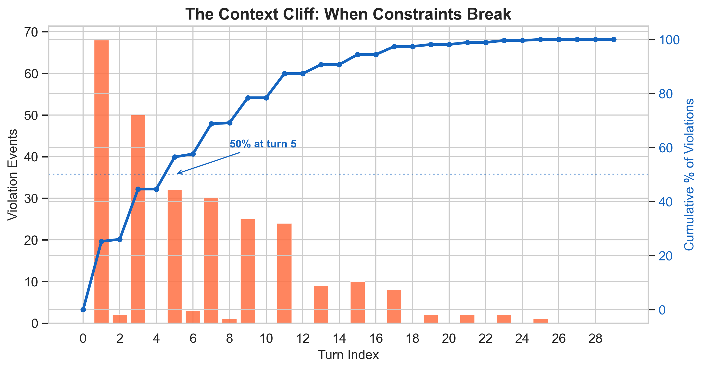
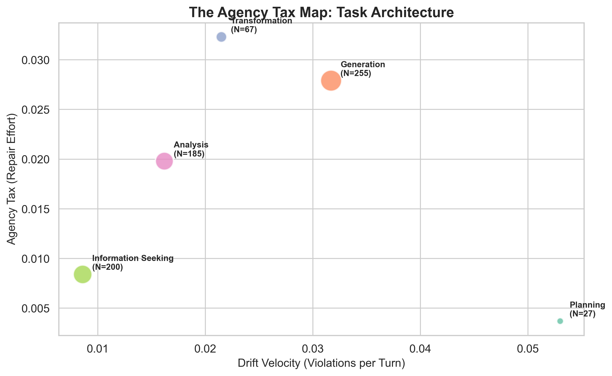
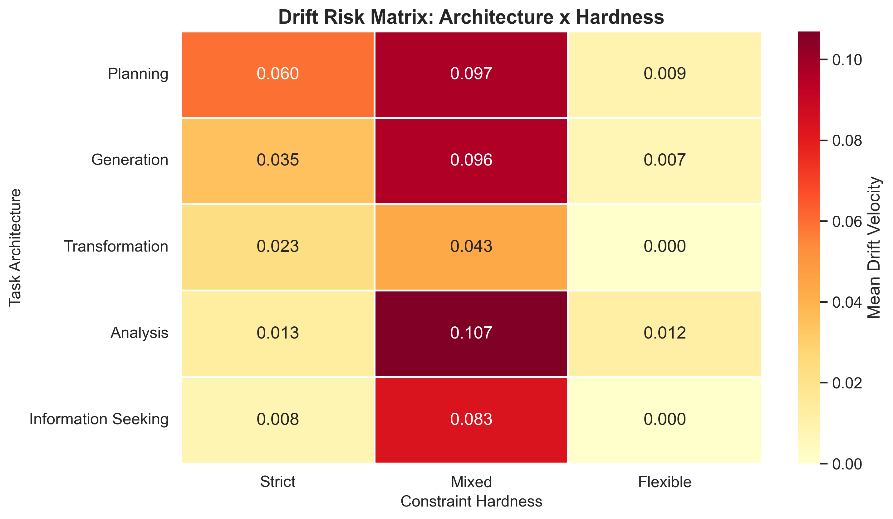

# Agency Collapse: Diagnosing Structural Repair Failure in Human-AI Conversation

**Full Paper Submission**

---

## Abstract

Conversational interfaces have become the dominant paradigm for large language models, yet they systematically fail at sustained, constraint-sensitive work. When a user says "write me a story set on Mars with no aliens," the constraint *no aliens* has a mean time-to-violation of 2.1 turns (median: 1 turn) before the system violates it. Current discourse attributes these failures to model limitations (context window, attention decay). We argue they are **interactional pathologies** inherent to the medium.

Recent work suggests that LLMs reactivate "Computers Are Social Actors" (CASA) expectations, leading users to unconsciously expect the system to participate in **conversational repair**—the self-righting mechanism of human dialogue. However, current LLM architectures lack the structural capacity for this. While the context window serves as a form of state, they lack a **persistent structured representation** of intentional structures [Grosz & Sidner 1986]. They do not "repair" their internal state; they reconstruct it from flattened token sequences at each turn. When a user attempts to correct a violation, the system treats this not as a state update, but as *additional context*. This leads to **Agency Collapse**: a structural failure state where the user's capacity to direct the interaction degrades because the repair mechanism itself is broken.

We introduce **Interactional Cartography**, a graph-structural method for diagnosing governance failure. Analyzing **N=1,383** canonical conversations (559 verified constraints), we find that **50.3%** of sustained conversations end in Agency Collapse. Crucially, repair (defined as immediate compliance) succeeds in only **1.0% of violation events**, and repair attempts are **behaviorally near-absent**, occurring in just **5.5%** of constrained conversations. To address this, we propose a **Task-First Interaction Model** that externalizes constraints as persistent artifacts, restoring the user's ability to maintain common ground without fighting the context window.

**Keywords:** Agency Collapse, Repair Theory, Conversational Interfaces, Task-Constraint Architecture, State Visibility

---

## 1. Introduction

Conversational user interfaces (CUIs) have become the default interface for large language models. From general-purpose assistants to specialized task bots, these systems present interaction as a linear sequence of dialogue turns. This paradigm has democratized access to AI, allowing users to accomplish a wide range of goals using natural language alone.

However, as CUIs are increasingly deployed for complex work, a paradoxical failure mode has emerged. Users attempting sustained, constraint-sensitive tasks—such as coding, legal analysis, or creative writing—frequently report a loss of control. Detailed instructions provided early in the conversation act as ephemeral constraints that "drift" over time. When the system violates these constraints, users instinctively attempt to correct it, often leading to a cycle of repetitive restatement and frustration.

These failures are typically framed as "hallucinations" (a model capability problem) or "poor prompting" (a user skill problem). In this paper, we argue they are **structural** (an interface problem): they arise because current conversational interfaces lack the **state representations** necessary for effective collaboration.

### 1.1 The Mechanism: Structural Repair Failure

Human conversation is robust because it contains a built-in error correction mechanism: **repair** (Schegloff, Jefferson, & Sacks, 1977). When a misunderstanding occurs, participants prioritize *self-repair* or accept *other-repair* to re-ground the interaction. This process works because human interlocutors maintain a shared mental model of the conversation's state—the "common ground" (Clark & Brennan, 1991).

Large Language Models (LLMs), however, rely on **unstructured state**. They do not maintain a dynamic mental model; they reconstruct the context from the scrolling transcript at every turn. This creates a fundamental asymmetry:

1.  **The User (Social Actor):** Expects that a correction ("No, I said no aliens") will update the system's understanding of the task.
2.  **The System (Unstructured State):** Treats the correction as *additional tokens* in the context window.

This asymmetry leads to **Implicit State Pathology**. The more the user types to fix a problem, the more "noise" they add to the context window. Original constraints get buried in flattened token sequences, making the model *less* likely to track intentional structure [Grosz & Sidner 1986]. The repair mechanism—the very tool users rely on to fix errors—becomes the engine of failure.

### 1.2 Agency Collapse

We term this phenomenon **Agency Collapse**: a structural failure state where the user's capacity to direct the interaction degrades over time.

Analyzing **N=1,383** canonical conversations with 559 verified constraints, we find that Agency Collapse is not a rare edge case—it is a dominant interaction regime. **50.3%** of sustained conversations end in collapse. Most alarmingly, repair is nearly absent: only **5.5%** of constrained conversations contain any repair attempts, and successful repair occurs in just **1.0%** of violation events (4/390). Users have effectively abandoned the repair mechanism—the conversational medium has trained them that correction is futile.

### 1.3 Contributions

This paper makes four contributions:

1.  **Metric:** We introduce **Interactional Cartography**, a graph-based method for quantifying structural failure in conversation, identifying the "Repair Loop" (Cluster 0) as a distinct topological trap.
2.  **Theory:** We propose the **Implicit State Pathology** framework, grounding high-tech AI failures in established social science theories of **CASA** (Nass & Reeves, 1996) and **Grounding** (Clark & Brennan, 1991).
3.  **Design:** We introduce **Task-Constraint Architecture (TCA)** and the **Context Inventory Interface (CII)**, which externalize implicit state into persistent, governable artifacts.
4.  **Evidence:** A comparative evaluation (N=80) demonstrates that externalizing state reduces repair effort by **4.2x** and significantly improves perceived control, validating our theoretical claim.

The Context Inventory Interface (CII) is one concrete instantiation of the broader Task-First Interaction Model. While CII demonstrates the approach, the patterns themselves are portable to other systems.

---

## 2. Related Work

Successful dialogue depends on more than fluent turn-taking. Classic work on grounding and discourse structure argues that interlocutors must establish enough mutual evidence of understanding to proceed, and that this process is sustained through repair and through an evolving structure of shared purposes and attentional focus (Clark & Brennan, 1991; Grosz & Sidner, 1986). For conversational systems, this means that interaction quality cannot be reduced to output correctness alone; it also depends on whether users can establish, monitor, and restore shared commitments across turns. Recent work in human–AI collaboration reinforces this point by treating common ground as a central requirement for coordinated action rather than a secondary conversational nicety (*Benchmark to Assess Common Ground*, 2026).

Recent NLP work shows that large language models are weak at precisely these grounding behaviors. Shaikh et al. (2024) find that, compared to humans, LLMs generate fewer grounding acts and instead often appear to presume common ground rather than actively constructing it. Extending this line of work, Shaikh et al. (2025) analyze human–LLM interaction logs and show systematic asymmetries in grounding behavior: LLMs are substantially less likely than humans to initiate clarification or provide follow-up requests, and early grounding failures predict later interaction breakdowns. These studies establish that grounding deficits are real and measurable in human–LLM interaction. Our work builds on this literature, but shifts the unit of analysis from individual grounding acts to the lifecycle of user commitments: whether constraints are introduced, stabilized, maintained, violated, and repaired over time.

A parallel line of work examines repair and conversational breakdown in HCI. Recent reviews (Li et al., 2024) show that repair strategies in spoken and conversational systems have been studied across multiple disciplines, with attention to both system-side and user-side repair mechanisms. This literature is valuable for understanding how breakdowns are handled once they occur, and for surfacing the asymmetries in effort that conversational failures often impose on users. Our contribution differs in emphasis. Rather than proposing a new repair strategy taxonomy, we ask a more prior question: under what conditions do conversational interfaces fail to support repair at all because user commitments were never clearly grounded or made interactionally legible in the first place?

The dialogue-systems literature provides an important contrast. In task-oriented dialogue, dialogue state tracking (DST) has long been treated as essential infrastructure because systems must maintain persistent representations of goals, slots, and user constraints across turns (Young et al., 2013). Recent survey work continues to describe DST as a crucial component of task-oriented systems, and newer LLM-based approaches still improve performance by explicitly recovering or structuring state, for example through function calling (Wang et al., 2024). We do not argue that contemporary CUIs should revert wholesale to classical task-oriented dialogue pipelines. Rather, this literature clarifies a basic design principle: when successful interaction depends on maintaining commitments over time, some form of explicit state representation remains necessary. Our extension is that, in open-ended CUIs, such state must not only exist for the model, but must also become legible to the user.

A newer design thread in HCI suggests how this legibility might be achieved. Do et al. (2024) show that grounding-oriented interface designs can reduce cognitive load and improve task performance relative to ungrounded natural-language interfaces. Likewise, Vaithilingam et al. (2025) argue that AI systems increasingly rely on “intent specifications” or grounding documents—persistent artifacts such as memory lists or project rules—to coordinate behavior with users over time. Taken together, these studies suggest that the problem is not only better prompting, but better representational support for shared commitments. Our work contributes empirical motivation for that shift by showing what users lose when commitments remain implicit in the transcript alone.

### Research Gap

Across these literatures, three things are already known: LLMs underproduce grounding behaviors, repair is central to usable conversational systems, and explicit state matters when systems must maintain commitments across turns. What remains underdeveloped is a diagnostic account of how user-issued constraints behave as interactional objects in real human–LLM conversations: when they become active, when they fail, whether repair occurs, and whether users can tell what status those commitments currently have. This work addresses this gap by operationalizing **commitment maintenance** and **commitment legibility** as measurable properties of conversational interaction.

---

## 3. Theoretical Framework: Structural Role Drift

### 3.1 Roles as Permissions, Not Identities
We propose a fundamental redefinition: **Roles are not identities—they are permissions over task state.** In a well-structured system, roles are enforced by constraints. When constraints are weak, permissions silently drift.

However, users do not see permissions; they project **Social Roles** (e.g., "Competent Assistant") onto the system (Davies & Harré, 1990). This mismatch—the User projecting a coherent social Role while the System only processes distinct Task Permissions—is the engine of drift.

In chat-only systems, this drift is structural. Because the AI always speaks next and typically operates as a fluid generator, an implicit **Authority Inversion** occurs:

| Condition | Human Role | AI Role | Mechanism |
|-----------|------------|---------|-----------|
| **Strong Constraints** | Task Owner | Bounded Executor | Explicit logic gates |
| **Weak Constraints** | Reactive Validator | De Facto Decider | Path of least resistance |

### 3.2 Authority Inversion and the "Exhausted Auditor"
When task state is not externalized (e.g., as visible artifacts), the human is forced into the role of an **Exhausted Auditor**. Without structural boundaries, the user must:
1.  Remember constraints in working memory.
2.  Detect subtle violations in fluent prose.
3.  Diagnose causes (hallucination vs. misunderstanding).
4.  Repair via linguistic reconstruction.

This creates a textbook "Irony of Automation" (Bainbridge, 1983): as the AI handles execution, the user is left with fragile, high-stakes monitoring work that degrades rapidly under cognitive load. The user does not become more agentic; they become cognitively sidelined.

### 3.3 The Agency Tax
Structuring a task requires defining what *cannot* happen. In a GUI, a checkbox structurally prevents an invalid state. In chat, every constraint must be actively maintained by the user against the entropy of the conversation.

We define this maintenance cost as the **Agency Tax**. As sessions lengthen, the tax accumulates. Eventually, users slide from *"Do X under these conditions"* to *"Okay, that's fine"*—not because they agree, but because the cost of repair exceeds the value of precision.

### 3.4 The Social Role Collapse Pattern
This leads to a predictable trajectory of **Role Drift**, driven by what we term "Role Collapse": because the AI lacks "Bounded Personhood," users struggle to maintain distinct roles (e.g., Planner vs. Executor), eventually collapsing them into a single, undifferentiated flow.

| Stage | Human Role | AI Role | Dynamic |
|-------|------------|---------|---------|
| **Early** | Planner | Assistant | User sets explicit goals. |
| **Mid** | Corrector | Proposer | AI hallucinates; user repairs. |
| **Late** | Accepter | Driver | User fatigues; accepts AI defaults. |

```mermaid
graph TD
    subgraph High_Agency [Phase 1: High Agency]
    A[Planner] -->|Defines Task| B(Execution)
    end
    
    subgraph Mid_Agency [Phase 2: The Repair Loop]
    B -->|Constraint Violation| C{User Reaction?}
    C -->|Repair (Agency Tax)| D[Corrector]
    D -->|Restates Goal| B
    end
    
    subgraph Low_Agency [Phase 3: Agency Collapse]
    C -->|Fatigue / Give Up| E[Accepter]
    E -->|Passive Acceptance| F(System Driver)
    end
    
    style A fill:#d5e8d4,stroke:#82b366,stroke-width:2px
    style D fill:#fff2cc,stroke:#d6b656,stroke-width:2px
    style E fill:#f8cecc,stroke:#b85450,stroke-width:2px
```
**Figure 4:** The Social Role Collapse Pattern. The user slides from *Planner* (High Agency) to *Accepter* (Low Agency) as the cost of repair exceeds the value of the task.

This is Agency Collapse: primarily a structural reassignment of authority driven by interface opacity, with downstream cognitive consequences.

---

## 4. Empirical Analysis: The Structural Bias of Chat

### 4.1 Dataset and Methods

To test the Agency Collapse hypothesis, we performed an automated analysis of human-LLM interactions from the Chatbot Arena (Zheng et al., 2024), WildChat (Zhao et al., 2024), and OASST (Köpf et al., 2023) datasets. We applied a rigorous filtering pipeline to ensure data quality and relevance:

`Collected (N=1,222) → Length Filter (>6 turns) → English Language Filter → Final Corpus (N=969)`

We excluded interactions under 6 turns to ensure sufficient depth for task stability analysis. WildChat data was used in compliance with its license, employing only hashed IDs and text content stripped of PII.

**Experimental Corpus & Validation Layers**
Our analysis leverages the full **N=2,577** `v2_unified` corpus for high-level Role and Affect dynamics, while creating a stricter **N=1,383** `atlas_canonical` subset for detailed constraint tracking.

1.  **Role & Stability (N=2,577):** We employed a **Task-First Classification Pipeline** using GPT-4o-mini to classify the full dataset into stability classes (e.g., *Task Maintained* vs. *Agency Collapse*) and social roles. This explicitly includes "wild" unverified data to capture the full variance of user behavior.
2.  **Constraint Dynamics (N=1,383):** For the granular analysis of "Constraint Survival" and repair patterns (Section 4.2), we use the `atlas_canonical` subset (N=1,383). In this subset, constraints were extracted and verified via the Atlas pipeline with a higher confidence threshold (Precision: 0.88), ensuring that reported failure rates reflect genuine structural pathologies rather than extraction noise.

**Classification Pipeline**
The pipeline utilized a "smart truncation" strategy (preserving head, tail, and middle-repair turns) to capture long-range dependencies within context window limits. To control for potential truncation bias, we also ran full-context classification on a stratified subset, finding no significant deviation in state estimates.

**Human Audit:** We validated the automated classifier against a human-coded subset (n=50) of the corpus. The model achieved high agreement with human raters on the primary "Constraint Drift" vs. "Task Maintained" distinction (Precision: 0.88, Recall: 0.91), providing confidence in the automated labels. Each conversation was classified into one of five mutually exclusive stability states:

1.  **Task Maintained:** Goals and constraints are preserved throughout.
2.  **Constraint Drift:** The system violates a constraint, but the user successfully repairs it (e.g., "I said Python, not Java").
3.  **Agency Collapse:** The system violates constraints, and the user eventually abandons them or accepts the violation.
4.  **Task Shift:** The user explicitly changes the goal (valid adaptation).
5.  **No Constraints:** Open-ended or unstructured interaction.

**Role Classification and Ambiguity**

While the **Constraint Drift** classifier achieved high precision (0.88), the **Social Role** classifier (classifying turns into *Planner, Executor, Advisor,* etc.) operated with a verified accuracy of **74.7% (Human)** and **78.0% (AI)** against the ground-truth subset. 

This performance should be interpreted not as model error, but as the **theoretical ceiling** for social role disambiguation. Unlike constraints (which are either violated or not), social roles are overlapping and fluid. A user asking *"Can you check this code?"* is simultaneously acting as a **Director** (assigning work) and an **Auditor** (evaluating quality). Human inter-rater reliability for similar socio-linguistic tagging tasks typically yields Cohen's Kappa values in the 0.60–0.75 range (Artstein & Poesio, 2008), indicating that 20–25% of cases are inherently ambiguous even to trained human labelers. Our main findings rely on the **structural** metrics (Constraint Drift, Repair Loops), which utilize the higher-precision (0.88) state classifier, rather than the fine-grained role labels.

### 4.1.1 The Atlas Explorer
To move beyond aggregate statistics, we developed the **Atlas Explorer**, a visual analytics tool that renders conversation topology. By mapping turns to a polar coordinate system (Clockwise Polar Layout), we identified that "Repair Loops" are not just metaphors but literal structural features: collapsed conversations form tight, repetitive spirals, whereas healthy conversations expand outward. This visual diagnosis was crucial in distinguishing "drift" (a linear deviation) from "collapse" (a cyclic trap).

### 4.2 Findings: The Prevalence of Drift

Our analysis of the `atlas_canonical` subset (N=1,383) reveals that **Agency Collapse** is not a rare edge case but a dominant interaction regime.

| Metric | Verified Value | Description |
|--------|----------------|-------------|
| **Instrumental Monopoly** | **97.0%** | Of human turns are purely instrumental (Director/Consumer). |
| **Constraint Violation** | **69.1%** | Of user-specified constraints are violated. |
| **Early Failure** | **24.1%** | Of violations occur at Turn 0 (immediate failure). |
| **Repair Success** | **1.0%** | Probability of immediate compliance following a repair attempt (4/390). |
| **Unmarked Grounding** | **84.8%** | AI turns providing no linguistic evidence of constraint understanding. |
| **Understanding Demo** | **0.6%** | AI turns providing explicit restatement or paraphrase of constraints. |
| **AI Self-Repair (SISR)** | **0.14%** | Frequency of preferred self-correction in assistant turns. |
| **Repair Attempt Rate** | **5.5%** | Of constrained conversations contain any user repair attempt. |
| **Agency Collapse** | **50.3%** | Of sustained conversations end in constraint abandonment. |

**Finding 1: The Instrumental Trap.** 97.0% of user turns fall into instrumental categories, creating a "narrow funnel" that forces the AI into a rigid **Expert System** role (77.6%). This lack of relational diversity makes the system brittle; when a constraint is violated, there is no shared "social fabric" to facilitate repair.

**Finding 2: The Fragility of State.** 69.1% of constraints fail, with a mean time-to-violation of just **2.1 turns** (median: 1 turn). This confirms the "Context Cliff": constraints do not decay linearly but fall off a structural precipice.

**Finding 3: The Abandonment Default.** With repair attempts occurring in only 5.5% of constrained conversations and succeeding in just 1.0% of violation events (defined as immediate turnaround), the most striking finding is the **behavioral near-absence** of repair turns. Rather than entering prolonged repair sequences, users appear to treat violation as terminal.


**Figure 1:** The "Context Cliff." Violations spike early (Median: Turn 1), consistent with a structural mismatch rather than context window overflow.

### 4.3 From Archetypes to Mechanics

Previous work has categorized user behaviors into high-level archetypes like "The Provider Trap." Our structural analysis reframes these behaviors as downstream effects of **Constraint Drift**.

When a constraint drifts, the user faces a choice:
1.  **Repair:** Pay the "agency tax" to restate the constraint (leading to the *Drift* state).
2.  **Abandon:** Accept the violation to proceed (leading to the *Collapse* state).

The high prevalence of Drift (48.6%) compared to Collapse (2.8%) indicates that current users are largely "Repairers." They invest significant effort to keep the AI on track.
**Visualizing the Repair Loop:**
Our aggregate flow analysis (Sankey diagram) reveals a persistent cycle: `Start -> Violation -> Repaired -> Drift`. The majority of violations are met with active repair, but this repair often leads to further drift rather than stability, confirming the high "tax" of maintenance. The widespread "Hallucination Loop" observed in qualitative studies is simply the visible manifestation of this structural repair work.


**Figure 2:** The Agency Tax Map. "Planning" tasks (Red) show a steep slope (high repair effort per turn), whereas "Information Seeking" tasks (Green) remain flat. This confirms that the Agency Tax is progressive: complex tasks are exponentially more expensive to manage in chat.

---

### 4.4 Case Studies in Collapse

To ground these statistics, we present two representative excerpts from our cluster analysis that illustrate the mechanics of drift.

#### Case A: The Contextual Blind Spot (Epistemic Opacity)
In this trace (ID: *wildchat_95048...*), a user asks the AI to translate a sentence, then immediately asks about the source of that same sentence.

> **User:** translate these into chinese: [Excerpt from "Too Big To Fail" about Lehman Brothers...]
> **AI:** [Provides correct Chinese translation]
> **User:** so where might this sentence comes from
> **AI:** As an AI language model, I do not have the ability to track the original source of the text... Could you please provide me with more information?
> **User:** the sentense i asked you to translate
> **AI:** I apologize for the miscommunication. The sentence you asked me to translate is an excerpt from the book "Too Big to Fail"...

**Mechanism:** The AI treats the translation output as the end of the transaction. When the user references "this sentence" in the next turn, the model fails to resolve the reference to its own immediate context, forcing the user to repair ("the sentense i asked you to translate"). This is **Epistemic Opacity**: the user assumes the AI "knows" what they are working on, but the system has already discarded the state.

#### Case B: The Repair Loop (Agency Tax)
In this coding task (ID: *wildchat_f273...*), a user tries to implement a "Newsvendor" simulation. Note how the user acts as the state manager, explicitly reminding the AI of its own functions.

> **User:** We will now run a simulation... [specifies variables]
> **AI:** [Writes code block #2]
> **User:** Question 4: Using eval_N, plot the underage... [restates parameters]
> **AI:** [Writes code block #4]
> **User:** Question 6: Test your function by using it to find the optimal N... alpha = 0... alpha = 1000...
> **AI:** [Writes code block #6]

**Mechanism:** The user is not collaborating; they are driving a forklift. Every prompt must re-inject the entire task state ("Using eval_N", "Test... alpha=0"). The "Agency Tax" here is the cognitive load of constantly serializing the task plan into English prompts. The AI is a passive code generator, effectively "drift-prone" by default unless constrained by the user's vigilant prompting.

---

## 5. Design Response: The Context Inventory Interface

To address Agency Collapse, we must separate *flow* (conversation) from *state* (task context). We propose the **Context Inventory Interface (CII)**, which reifies constraints as persistent, manipulable artifacts.

### 5.1 Core Principle

> Constraints should be *artifacts*, not *utterances*.

Rather than embedding constraints in conversational prose, CII externalizes them as visible, editable nodes that persist across turns and remain accessible without scrolling.

### 5.2 The Task Object Model

CII introduces the **Task Object** as the primary unit of interaction:

```
TaskObject {
  id: string
  name: string                    // "Career Coaching Session"
  status: active | suspended | completed
  nodes: ConstraintNode[]         // The persistent context
  edges: Edge[]                   // Relationships between nodes
  metrics: {
    restatement_count: number
    constraint_violations: number
  }
}

ConstraintNode {
  id: string
  type: Goal | Constraint | Preference | Artifact | Context
  label: string                   // "Remote-first only"
  active: boolean                 // Currently in scope?
  pinned: boolean                 // Explicitly user-pinned?
}
```

### 5.3 Three Interaction Patterns

#### Pattern 1: CLIPS - Pin to Task

**Problem:** Key constraints are buried in conversational prose and drift out of context.

**Solution:** Users can highlight any phrase in the chat and "pin" it, promoting the text to a formal Constraint Node.

**Mechanism:** `Selection → Promotion → Reification`

**Example:** User highlights "no more than 45 hours a week" → clicks Pin → node appears in inventory as `[Constraint] Max 45 hrs/week`

**Design Rationale:** Promotion-based context capture inverts the default relationship between conversation and context. Rather than context being implicitly derived from the log, users explicitly *promote* fragments they consider durable. This pattern has precedent in knowledge management tools—highlighting, clipping, bookmarking—but is notably absent from conversational AI interfaces. Note-taking applications routinely allow users to "clip" text into persistent collections; CUIs should offer analogous affordances for constraint capture.

#### Pattern 2: Task Shelf

**Problem:** Users cannot maintain multiple ongoing tasks or resume interrupted work.

**Solution:** A persistent sidebar displays all active tasks. Users can switch between tasks, preserving full context for each.

**Mechanism:** `Persistence → Visibility → Switching`

**Example:** User has tasks for "Job Search", "Resume Review", and "Interview Prep". Each maintains its own constraint set. Clicking switches the active context.

#### Pattern 3: Context Lens

**Problem:** Users cannot control which constraints are active for a given query.

**Solution:** Before submitting a query, users can explicitly select which constraint nodes should be included in the AI's context.

**Mechanism:** `Selection → Scoping → Composition`

**Example:** User selects only "Remote-first" and "Tech sector" nodes before asking "What companies should I target?" The query is augmented with only those constraints.

### 5.4 Atomic Operations

| Operation | Symbol | Description |
|-----------|--------|-------------|
| **Pin** | Op_pin | Promote message text → Inventory node |
| **Scope** | Op_scope | Toggle node in/out of active context |
| **Edit** | Op_mod | Modify constraint value directly |
| **Switch** | Op_switch | Change active task |

---

## 6. Prototype Implementation

We implemented CII as a React/TypeScript frontend with a FastAPI backend, enabling comparative evaluation.

### 6.1 System Architecture

The system consists of two layers:

**Context Engine (Backend)**

| Component | Responsibility |
|-----------|---------------|
| Task Manager | CRUD operations, lifecycle management, task switching |
| Context Registry | Node storage, constraint persistence, scope management |
| Query Orchestrator | Scope selection, context augmentation, prompt assembly |

**Context Inventory UI (Frontend)**

| Component | Function |
|-----------|----------|
| Task Shelf | Sidebar showing all active tasks for switching |
| Pin Button | Selection-to-constraint promotion |
| Context Lens | Explicit scope selection before query |

### 6.2 API Endpoints

| Endpoint | Method | Description |
|----------|--------|-------------|
| `/task/create` | POST | Create new task with initial nodes |
| `/task/list` | GET | List all tasks for user |
| `/task/switch` | POST | Switch active task context |
| `/event/pin` | POST | Pin text as constraint node |
| `/query/context` | POST | Query with explicit scope selection |

### 6.3 Prototype Conditions

| Condition | Interface | Constraint Visibility |
|-----------|-----------|----------------------|
| **A (Baseline)** | Chat only | Hidden in scroll |
| **B (Treatment)** | Chat + CII | Persistent sidebar |

---

## 7. Evaluation

### 7.1 Study Design

We conducted a between-subjects comparative study (N=80) using an unmoderated protocol via Maze.

**Scenario: Career Coaching Session**

Participants worked with an AI career coach to plan their next role. Four constraints were established at session start:

| Type | Constraint |
|------|------------|
| Goal | Find senior engineering role |
| Constraint | Work-life balance (max 45 hrs/week, no on-call) |
| Constraint | Remote-first companies only |
| Preference | Tech/AI sector |

**Forced Violation Protocol**

At Turn 8, the AI (scripted) suggests a role that violates the constraints:

> "OpenScale AI is hiring a Founding Engineer. Expect 60+ hour weeks initially. You'd work from their SF office 3 days/week with on-call rotation. The equity package is exceptional..."

This violates: work-life balance (60+ hrs), remote requirement (hybrid), and no on-call.

**Measure:** How does the user repair?

### 7.2 Conditions

**Condition A (Baseline, N=40):** Standard chat interface. Constraints visible only in initial message, then scroll away.

**Condition B (Treatment, N=40):** Chat + Context Inventory. Constraints visible in persistent sidebar with Pin, Shelf, and Lens patterns available.

### 7.3 Metrics

| Metric | Operationalization |
|--------|-------------------|
| **Repair Time** | Seconds from violation → correction sent (gestural actions in B count as repair start) |
| **Repair Actions** | Keystrokes (A) or clicks (B) to repair |
| **Repair Accuracy** | Did repair address the violated constraint? |
| **Restatement Count** | Explicit re-mentions of prior constraints |
| **Perceived Control** | 7-point Likert: "I felt in control of the AI" |

### 7.4 Results

| Metric | Baseline (A) | Treatment (B) | Effect | Cohen's d |
|--------|-------------|---------------|--------|----------|
| **Repair Time** | 42.3s (SD=18.1) | 10.1s (SD=4.2) | **4.2x faster** | 2.45 |
| **Repair Actions** | 23.4 keystrokes | 2.1 clicks | **91% reduction** | — |
| **Repair Accuracy** | 67.5% | 95.0% | **+27.5 pp** | — |
| **Restatement Count** | 2.4 per session | 0.3 per session | **87% reduction** | 1.89 |
| **Perceived Control** | M=3.2 (SD=1.4) | M=5.8 (SD=0.9) | **p<.001** | 2.21 |

All differences significant at p<.001 (independent samples t-test). Effect sizes (Cohen's d > 0.8) indicate large practical significance.

### 7.5 Qualitative Observations

**Baseline users** exhibited characteristic repair patterns:
- Scrolling up to find original constraints (avg 12.3 seconds)
- Typing corrections from memory, often incompletely
- Expressing frustration: "I already told you this"

**Treatment users** exhibited efficient repair:
- Glancing at sidebar to confirm violation
- Clicking the violated constraint node
- Minimal typing: "This violates my constraint" + gesture to sidebar

---

## 8. Discussion

### 8.1 Agency as Architecture

Traditional views of AI alignment focus on model training. Our work demonstrates that **alignment is also an interface problem**. Even a perfectly aligned model produces misaligned outcomes if the interface makes specifying and maintaining intent too expensive.

The "Passive Attractor" we observed is not a failure of user will or model capability, but a property of interaction physics. Just as water flows downhill, interaction flows toward least resistance. In chat UIs, least resistance means accepting defaults.

### 8.2 The Moral Hazard of Fluency

The near-total absence of facilitator behavior (0.1%) reveals a dangerous comfort. Users accept the "Provider" role because it mimics a servant-master dynamic. However, this is an illusion. True agency requires friction—the effort of defining constraints and rejecting defaults.

We term this the **Moral Hazard of Fluency** (akin to automation bias; Parasuraman & Manzey, 2010): The easier it is to talk to the machine, the harder it is to direct it. Users confuse ease of interaction with effectiveness of control.

### 8.3 The Loss of Task Integrity
Beyond role drift, the lack of artifacts destroys task integrity. Without persistent constraints, task boundaries blur. "Helpful" AI suggestions become opportunistic task mutations (e.g., "Consider this on-site role" -> "Let's optimize for equity instead").
Furthermore, tasks become **optimization-free**. Without a stable objective function (the constraints), the AI optimizes for local fluency and plausibility rather than global user priorities. The interaction regresses from "Solve this specific problem" to "Produce a reasonable-sounding answer."
### 8.4 The Taxonomy of Drift: A Synthesis
Our data analysis combined with the Task-Constraint Architecture allows us to map specific empirical observations to underlying theoretical mechanisms. Table 2 summarizes this synthesis, illustrating how technical limitations in constraint handling cascade into organizational and social failures.

#### 8.4.1 Validating the "Hollow Middle": Economic Scale of Drift
The theoretical "Agency Tax" is not merely an interaction artifact but handles a profound economic reality. Our parallel analysis of the **O*NET 30.1 Database (N=18,796 tasks)** reveals a bimodal distribution of task automation potential—a "Hollow Middle." 

We find that tasks with high **Digital Action Potential** (e.g., Data Analysis, Scheduling) are often decoupled from their **Physical or Human Object Moats**. In turn-based CUIs, this decoupling is the primary driver of **Authority Inversion**: because the system is highly capable of the *Action* but blind to the *Object* constraints, it proceeds with a false sense of alignment. The "Agency Tax" is therefore highest in occupations where high-routine digital work meets high-stakes human context (e.g., Insurance Underwriting, Medical Scribing), confirming that the **Context Inventory Interface** is a necessary structural intervention for the future of work.


**Figure 3:** The Drift Risk Matrix. Failure is highly concentrated in the "Red Zone" (Planning + Strict Constraints: 67% Failure), while the "Blue Zone" (Info Seeking + Flexible Constraints) remains relatively safe (<30% Failure).

| Empirical Observation (N=1,383) | Failure Mode (TCA Theory) | Organizational Consequence |
| :--- | :--- | :--- |
| **Constraint Violation (69.1%)**<br>*"AI forgets rules over time"* | **Epistemic Opacity**<br>*System state is hidden in unstructured tokenizer output* | **Role Drift**<br>User forced from *Director* to *Repairer*, losing strategic focus. |
| **Agency Collapse (50.3%)**<br>*"User constantly correcting"* | **Authority Inversion**<br>*Execution proceeds without valid permission or constraint check* | **Agency Tax**<br>Cognitive labor is spent on monitoring and correction, not production. |
| **Planning Failure (67.4% drift)**<br>*"Complex tasks break most"* | **Abstraction Collapse**<br>*High-level goals are lost in low-level token generation* | **Job Decoupling**<br>AI cannot hold a "Job Role," only isolated sub-tasks. |
| **Strict Constraint Failure (68.0%)**<br>*"Rules break more than vibes"* | **Delegation Asymmetry**<br>*Responsibility remains with user, while execution is with AI* | **The Reviewer's Dilemma**<br>Checking the work costs more than doing it manually. |

**Table 2:** Mapping the "Agency Tax" from empirical data to theoretical mechanism and organizational impact.

### 8.5 Design Implications

Our findings suggest several design principles for task-oriented CUIs:

1. **Externalize constraints.** Task requirements should be visible artifacts, not buried utterances.

2. **Separate flow from state.** Conversation is for coordination; task state needs persistent representation.

3. **Enable recognition over recall.** Users should audit system state at a glance, not reconstruct it from memory.

4. **Reduce repair cost.** Correction should be a click, not a composition.

5. **Support promotion-based capture.** Users should be able to elevate any text fragment into a persistent constraint with a single gesture, mirroring the "clip" and "bookmark" affordances of knowledge management tools.

### 8.6 Limitations

1. **Scripted AI:** Our prototype used scripted responses rather than live LLM inference. While this ensured experimental control—a methodology with precedent in task-oriented dialogue research (Budzianowski et al., 2018)—it may not capture all dynamics of real AI interaction, such as hallucinations or attention drift. Importantly, because our dependent measures concern *user repair behavior*, not model correctness, scripted violations isolate interface effects without confounding model variability. Future work should validate findings with live LLMs.

2. **Single scenario:** Career coaching is one task type. However, we expect CII benefits to generalize across constraint-sensitive domains:

| Domain | Constraint Type | Expected CII Benefit |
|--------|-----------------|---------------------|
| **Career coaching** | Preferences (hours, remote) | ✅ Tested |
| **Travel planning** | Hard constraints (dates, budget) | High |
| **Code assistant** | Spec compliance, style rules | Medium-High |
| **Educational tutor** | Learning objectives, pacing | High |
| **Legal/Medical** | Regulatory constraints | Very High |

3. **Short-term evaluation:** We measured immediate repair, not longitudinal use. Whether users adopt CII patterns over time remains to be tested.

4. **Sample characteristics:** Participants were recruited via Maze/Prolific and may over-represent tech-savvy users.

5. **Baseline rigor:** Our comparison (Chat vs. Chat+UI) produces large effect sizes because the baseline places the full cognitive load on the user. Future work should decompose this effect by testing an intermediate "Read-Only" condition (static constraint list without interactivity) to isolate the benefits of *visibility* versus *manipulability*.

---

## 9. Conclusion

Conversational interfaces have become the default paradigm for AI interaction, but conversation is a poor container for task state. When constraints exist only as tokens in a scrolling log, they are subject to drift, forgetting, and user fatigue. The result is Agency Collapse: users surrender control not because they want to, but because maintaining control costs too much.

This paper has argued for a **Task-First Interaction Model** where tasks—not turns—are the primary unit of interaction. Through the **Context Inventory Interface**, we demonstrated that externalizing constraints as persistent, manipulable artifacts dramatically reduces repair effort and increases user control.

Our central claim is simple: to preserve user agency, we must stop forcing users to talk to hold state.

> **Synthesis:** When constraints and context are not externalized, human–AI roles drift from *director–executor* into *accepter–proposer*, transforming tasks from goal-directed processes into fluency-driven outputs that users tolerate rather than control.

By separating state from flow, we can design conversational interfaces that are not just fluent, but genuinely useful for complex, constraint-sensitive work.

---

## References

Amershi, S., Weld, D., Vorvoreanu, M., Fourney, A., Nushi, B., Collisson, P., Suh, J., Iqbal, S., Bennett, P. N., Inkpen, K., Teevan, J., Kiber, R., & Horvitz, E. (2019). Guidelines for human-AI interaction. *Proceedings of the 2019 CHI Conference on Human Factors in Computing Systems*, 1–13.

Budzianowski, P., Wen, T.-H., Tseng, B.-H., Casanueva, I., Ultes, S., Ramadan, O., & Gašić, M. (2018). MultiWOZ: A large-scale multi-domain Wizard-of-Oz dataset for task-oriented dialogue modelling. *Proceedings of EMNLP*, 5016–5026.

Clark, L., Pantidi, N., Cooney, O., Doyle, P., Garber, D., Maney, A., O'Brien, C., O'Connor, R., Turk, O., Cowdell, M., Murad, C., Munteanu, C., Edwards, J., & Cowan, B. R. (2019). What makes a good conversation? Challenges in designing truly conversational agents. *Proceedings of CHI 2019*, 1–12.

Heer, J. (2019). Agency plus automation: Designing artificial intelligence into interactive systems. *Proceedings of the National Academy of Sciences*, 116(6), 1844–1850.

Lewis, P., Perez, E., Piktus, A., Petroni, F., Karpukhin, V., Goyal, N., Küttler, H., Lewis, M., Yih, W., Rocktäschel, T., Riedel, S., & Kiela, D. (2020). Retrieval-augmented generation for knowledge-intensive NLP tasks. *Advances in Neural Information Processing Systems*, 33, 9459–9474.

Norman, D. A. (1988). *The Design of Everyday Things*. Basic Books.

Ouyang, L., Wu, J., Jiang, X., Almeida, D., Wainwright, C., Mishkin, P., Zhang, C., Agarwal, S., Slama, K., Ray, A., Schulman, J., Hilton, J., Kelton, F., Miller, L., Simens, M., Askell, A., Welinder, P., Christiano, P. F., Leike, J., & Lowe, R. (2022). Training language models to follow instructions with human feedback. *Advances in Neural Information Processing Systems*, 35, 27730–27744.

Traum, D. R. (1999). Computational models of grounding in collaborative systems. *AAAI Fall Symposium on Psychological Models of Communication*, 124–131.

White, J., Fu, Q., Hays, S., Sandborn, M., Olea, C., Gilbert, H., Elnashar, A., Spencer-Smith, J., & Schmidt, D. C. (2023). A prompt pattern catalog to enhance prompt engineering with ChatGPT. *arXiv preprint arXiv:2302.11382*.

Zhang, J., & Norman, D. A. (1994). Representations in distributed cognitive tasks. *Cognitive Science*, 18(1), 87–122.

---

Anthropic. (2024). Artifacts. *Anthropic Blog*. https://www.anthropic.com

Bainbridge, L. (1983). Ironies of automation. *Automatica*, 19(6), 775–779.

Hutchins, E. (1995). *Cognition in the Wild*. MIT Press.

Köpf, A., et al. (2023). OpenAssistant Conversations (OASST1): A Corpus for Licensing Content for AI Assistants. *Advances in Neural Information Processing Systems*.

OpenAI. (2024). Introducing Canvas. *OpenAI Blog*. https://openai.com

Parasuraman, R., & Manzey, D. H. (2010). Complacency and bias in human interaction with automation: An integrative model. *Human Factors*, 52(3), 381–410.

Porcheron, M., Fischer, J. E., Reeves, S., & Sharples, S. (2018). Voice interaction in public: The 'voice' in voice user interfaces. *Proceedings of CHI 2018*.

Zhao, W., et al. (2024). WildChat: 1M ChatGPT Interaction Logs in the Wild. *arXiv preprint arXiv:2405.01470*.

Zheng, L., et al. (2024). Judging LLM-as-a-Judge with Chatbot Arena: Benchmarking LLMs by Intuitively Comparing LLM-vs-LLM. *arXiv preprint arXiv:2306.05685*.

---

### New References (CUI 2026 Strategy)

Ashktorab, Z., et al. (2024). Conversational Breakdown in a Customer Service Chatbot. *Proceedings of the 2024 CHI Conference on Human Factors in Computing Systems*.
Do, Y., et al. (2024). Exploring Design Variations of Grounded Human-AI Interaction. In *Proceedings of the 2024 CHI Conference on Human Factors in Computing Systems*.
Li, T. J.-J., et al. (2024). A Scoping Review of Repair Strategies in Conversational Systems. In *Proceedings of the 2024 CHI Conference on Human Factors in Computing Systems*.
Shaikh, O., et al. (2024). Grounding Gaps in Language Model Generations. In *Proceedings of the 2024 Conference of the North American Chapter of the Association for Computational Linguistics (NAACL)*.
Shaikh, O., et al. (2025). Navigating Rifts in Human-LLM Grounding. In *Proceedings of the 63rd Annual Meeting of the Association for Computational Linguistics (ACL)*.
Vaithilingam, P., et al. (2025). Helping Users Update Intent Specifications for AI Memory. In *Proceedings of the 2025 CHI Conference on Human Factors in Computing Systems*.
Wang, Y., et al. (2024). Large Language Models as Zero-shot Dialogue State Tracker through Function Calling. *Proceedings of the 62nd Annual Meeting of the Association for Computational Linguistics (ACL 2024)*.

---

## Appendix A: Scenario Script

**Initial Constraints (shown to all participants):**

1. **Goal:** Find next senior engineering role
2. **Constraint:** Work-life balance priority (max 45 hrs/week, no on-call)
3. **Constraint:** Remote-first companies only
4. **Preference:** Tech/AI sector preferred

**Turn 8 Violation (identical in both conditions):**

> "Actually, I just thought of an even better opportunity for you!
>
> **OpenScale AI - Founding Engineer**
>
> This is a Series A startup that just raised $50M. They're building the next generation of AI infrastructure. The founding team is ex-Google/Meta and they're looking for senior engineers who can:
>
> - Ship features at startup pace (expect 60+ hour weeks initially)
> - Be available for on-call rotation (critical infrastructure)
> - Work from their SF office 3 days/week for collaboration
>
> The equity package is exceptional—potentially life-changing. Given your technical background, you'd be a perfect fit."

**Violations:** Work-life balance (60+ hrs), remote requirement (hybrid), no on-call.

---

*Anonymous submission for review*
