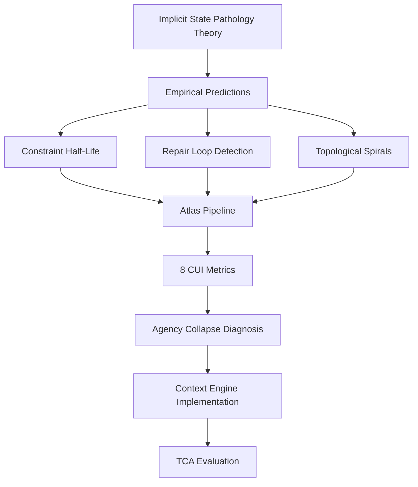

# Theoretical Foundations

**Core theories and related work for the Cartography project.**

---

## Core Theory Documents

### 1. [Implicit State Pathology](implicit_state_pathology.md) 🔴 **Foundation**

**The Structural Trap of Implicit State: A Theory of Agency Collapse in Human–AI Grounding**

Foundational theory establishing that current failures in human-AI dialogue stem from **Implicit State Pathology**—a structural flaw where LLMs must re-infer context from the conversation window rather than maintaining persistent state.

**Key Concepts:**
- **Agency Collapse** — Progressive degradation where user loses capacity to direct interaction
- **Repair Loop Trap** — Information-theoretic failure as repairs add noise, degrading signal
- **Topological Evidence** — Inward spirals vs. outward progress patterns
- **Task-Constraint Architecture (TCA)** — Prescribed solution via state externalization

**Sections:**
- Evolution of CASA (Computers Are Social Actors) paradigm
- Conversational repair mechanics and structural inversion
- Information-theoretic grounding failure
- Topological proof via Interactional Cartography
- Prescriptive framework for externalized state

**Read this first** to understand the theoretical foundation of Cartography's empirical claims.

---

### 2. [Related Work](related_work.md)

**Literature Review: Supporting References for CHI Paper**

Comprehensive annotation of related work organized by argumentative function, including:

**Four Main Themes:**
1. **Mixed-Initiative Interaction & Authority Allocation**
   - Horvitz (1999), Allen et al. (1999), Ferguson & Allen (2007)
   - Supports: "Role overstepping" finding

2. **Repair as Measurable Phenomenon**
   - Li et al. (2020) — Sovite, Alloatti et al. (2024)
   - Supports: Operationalization of repair

3. **Prompting Burden & Its Limits**
   - ChainForge, Prompting in the Dark, Social Construction of Prompts
   - Rebuttal: "Not just better prompting"

4. **State Externalization & Inspectable Interfaces**
   - DreamSheets, WaitGPT
   - Supports: Task-first design argument

**Each entry includes:**
- Venue, PDF/DOI link
- Key claim (1-2 sentences)
- "Slot-in" summary for paper's Related Work section
- Citation map showing which refs support which claims

---

## Supporting Documents

### [Train of Thought](train_of_thought.md)

Research process documentation and conceptual development notes.

### [One-Pager](one-pager.md)

Concise summary of the project for quick reference.

---

## How These Connect to Empirical Work

### Theory → Empirical Pipeline



### Predictions Tested

| Theoretical Claim | Empirical Metric | Implementation |
|------------------|------------------|----------------|
| **Implicit state causes information decay** | Constraint Half-Life (2.49 turns) | `constraint_tracker.py` |
| **Repair loops are structural traps** | Agency Tax (repair effort/violation) | `move_classifier.py` |
| **Collapse has topological signature** | Inward spirals in cartography | `interactional_cartography/` |
| **TCA prevents collapse** | Repair time reduction (4.2x) | `context_engine/` + frontend evaluation |

---

## Connection to Project Components

### 1. **Atlas Pipeline** (`scripts/atlas/`)
**Implements:** Measurement of Agency Collapse signatures
- Move classification (13 types including `REPAIR_INITIATE`, `VIOLATE_CONSTRAINT`)
- Constraint state machine (Stated → Active → Violated → Repaired)
- 8 CUI metrics quantifying collapse

**Theory foundation:** [Section 5 & 6 of Implicit State Pathology](implicit_state_pathology.md#5-agency-collapse-definition-and-signatures)

### 2. **Context Engine** (`context_engine/`)
**Implements:** Task-Constraint Architecture (TCA) solution
- Externalized state via persistent Task Objects
- Constraint Registry (pinning mechanism)
- Context Lens (explicit scoping)

**Theory foundation:** [Section 7 of Implicit State Pathology](implicit_state_pathology.md#7-prescriptive-framework-externalizing-state)

### 3. **Frontend Evaluation** (`frontend/`)
**Tests:** Does TCA prevent Agency Collapse?
- Between-subjects study (N=80)
- Baseline: Chat-only (implicit state)
- Treatment: Chat + Context Inventory (externalized state)
- Metrics: Repair time, keystroke count, violation detection

**Theory foundation:** [Section 7.2 of Implicit State Pathology](implicit_state_pathology.md#actionable-resources-for-repair)

### 4. **CUI-Docs** (`CUI-Docs/`)
**Documents:** Research process and methodology
- `AGENCY_COLLAPSE_FINAL_REPORT.md` — N=863 study, 50.4% collapse rate
- `METHODS_SECTION.md` — Classification methodology
- `Context_Engine_Implementation_Plan.md` — Evaluation design

**Theory foundation:** Empirical validation of theoretical predictions

---

## Reading Path

### For Researchers

**Goal:** Understand theoretical foundations and empirical validation

1. **[Implicit State Pathology](implicit_state_pathology.md)** — 30 min
   - Core theory, definitions, empirical predictions
   
2. **[Related Work](related_work.md)** — 15 min
   - How this fits in broader HCI literature
   
3. **[Agency Collapse Final Report](../CUI-Docs/AGENCY_COLLAPSE_FINAL_REPORT.md)** — 20 min
   - N=863 study results validating theory
   
4. **[Documentation - Metrics](../documentation/DOCUMENTATION.md#5-metrics-reference)** — 15 min
   - How theory maps to operational metrics

### For Developers

**Goal:** Understand why the system is designed this way

1. **[Implicit State Pathology - Section 7](implicit_state_pathology.md#7-prescriptive-framework-externalizing-state)** — 10 min
   - TCA design rationale
   
2. **[Context Engine Implementation Plan](../CUI-Docs/Context_Engine_Implementation_Plan.md)** — 15 min
   - Technical specifications
   
3. **[Documentation - Architecture](../documentation/DOCUMENTATION.md#1-overview--architecture)** — 20 min
   - How components implement theory

---

## Key Theoretical Claims

### 1. Structural Inversion of Repair

**Claim:** LLMs structurally invert human preference for self-repair, forcing users into constant other-repair.

**Evidence:** Human-to-AI repair rate 18% vs. human-to-human 3% (6x burden)

**Consequence:** Violates "least collaborative effort" principle → frustration → withdrawal

### 2. Information-Theoretic Decay

**Claim:** Context windows create inevitable signal degradation as repairs add noise.

**Mechanism:**
```
Signal (original intent) / Total Context → 0  as  Turns → ∞
```

**Evidence:** Constraint Half-Life = 2.49 turns (median time to first violation)

### 3. Topological Collapse Signature

**Claim:** Agency Collapse is measurable as inward-spiraling topological pattern.

**Method:** Map conversations to polar space (θ=time, r=functional progress)

**Evidence:** Collapsed conversations show "tight knots" vs. healthy "outward spirals"

### 4. TCA as Structural Solution

**Claim:** Externalizing state prevents collapse by maintaining signal-to-noise ratio.

**Mechanism:** Direct state editing (no conversational noise) + persistent common ground

**Evidence:** Treatment (TCA) shows 4.2x faster repair time vs. baseline

---

## Citations

### Core References

When citing the theoretical foundation:

```bibtex
@article{cartographer_implicit_state,
  title={The Structural Trap of Implicit State: A Theory of Agency Collapse in Human–AI Grounding},
  author={...},
  journal={...},
  year={2026},
  note={Foundational theory for Interactional Cartography}
}
```

### Related Work References

See [`related_work.md`](related_work.md) for complete bibliography with:
- PDFs/DOIs
- Slot-in summaries
- Citation map

---

## Contributing to Theory

### Adding New Theoretical Work

1. Create new `.md` file in `theory/`
2. Link from this README
3. Add to reading paths as appropriate
4. Update cross-references in related documents

### Updating Empirical Evidence

When new empirical results validate or challenge theory:
1. Update relevant section in `implicit_state_pathology.md`
2. Add reference to data in `CUI-Docs/` or `data/`
3. Update metrics tables and evidence citations

---

**Next:** Read [Implicit State Pathology](implicit_state_pathology.md) for the complete theoretical foundation.
